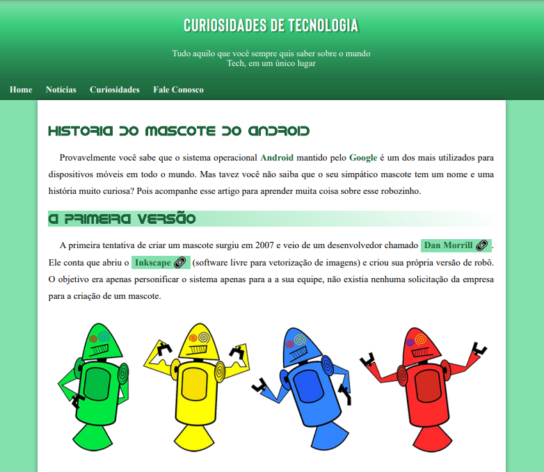
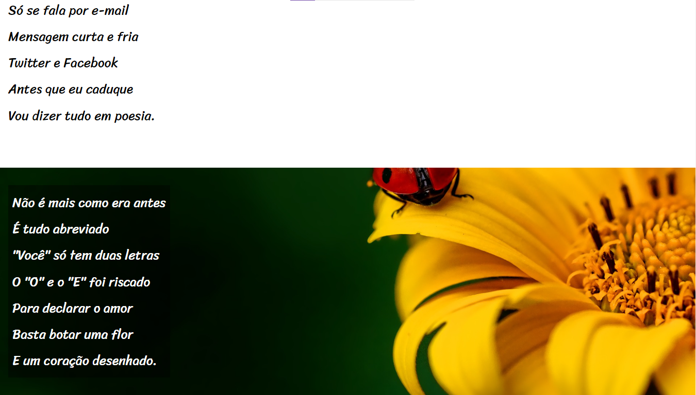

# HTML5 e CSS3
Projects and some of my studies on web development.

### Android Project 
 



### Cordel Project 
 



## 💾 Clone the repository:
- Clone by Git: (_For this step you need Git installed_)
```
git clone https://github.com/BMR23/HTML-CSS.git
```
- Or you can just download the zip file instead by clicking the button _Code_ and then _Download ZIP_ in this url: https://github.com/BMR23/HTML-CSS
<br>

## Author 
<p>
    <a href="https://github.com/BMR23">
    BMR23
    </a>
</p>

## License
MIT License <br>
<a href="https://bmr23.github.io/HTML-CSS/LICENSE">Download</a>
